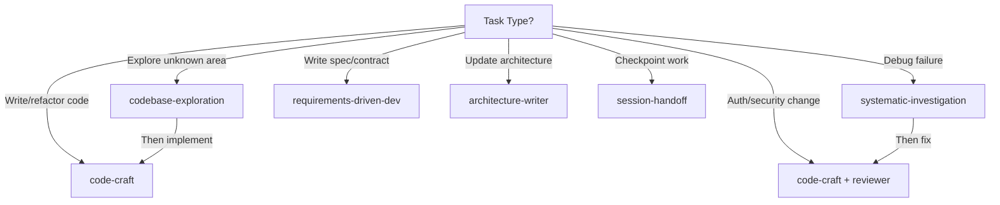

# Skills Discovery — RoboData

Use index-first routing. Read `../skills/INDEX.md` (resolved from the active agent config root) when skill routing is needed. Match the request to the smallest applicable skill. Load the skill's `SKILL.md` only after the index route matches.

---

## When to Check

1. Read `INDEX.md` when skill routing is needed.
2. Match the request to the smallest applicable skill.
3. Load the selected skill's `SKILL.md` only after the index route confirms it.
4. Compose a second skill only when it is a clear safety or review lens.

---

## RoboData Default Routing

| Task Category | Primary Skill | Notes |
|---|---|---|
| Any code write / refactor | `code-craft` | Default baseline for non-trivial implementation |
| Navigation across 3+ files | `codebase-exploration` | Before major refactors; especially for drift mapping |
| Auth, permissions, security code | `reviewer` | Always load for `backend/auth.py`, `judge_session_id` logic, password/token handling |
| Spec writing / PRD / TRD | `requirements-driven-dev` | For `docs/specs/` changes, pipeline stage contract design |
| Architecture doc updates | `architecture-writer` | For `docs/architecture.md` changes, module boundary changes |
| Debugging / root cause | `systematic-investigation` | Pipeline failures, isolation breaches, queue bugs |
| Checkpoint / resume | `session-handoff` | After slice completion, before device switch |

---

## Precedence

- `code-craft` is the default primary skill for implementation. It is not the "narrowest" to skip.
- Prefer the most specific skill over broad methodology for non-implementation tasks.
- Prefer no skill for purely mechanical changes: formatting, config values, renaming with no logic changes.
- For explicit review requests, use the `reviewer` skill.
- Compose only `code-craft` + `reviewer` (security lens) or `codebase-exploration` + `code-craft` (explore then implement). Do not compose 3+ skills.

---

## Skill Composition Patterns (RoboData)

---

## Common RoboData Task → Skill Map

| User Says | Skill to Load |
|---|---|
| "Implement the JobStore filesystem backend" | `code-craft` |
| "Add admin password auth" | `code-craft` + `reviewer` |
| "Fix judge isolation bug" | `systematic-investigation` → `code-craft` + `reviewer` |
| "Map all drift sites in the codebase" | `codebase-exploration` |
| "Design the queue/worker interface" | `requirements-driven-dev` |
| "Update architecture.md after domain/ extraction" | `architecture-writer` |
| "Refactor routes.py to remove pipeline logic" | `codebase-exploration` → `code-craft` |
| "Save my progress" | `session-handoff` |
