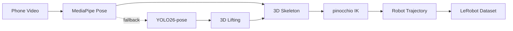
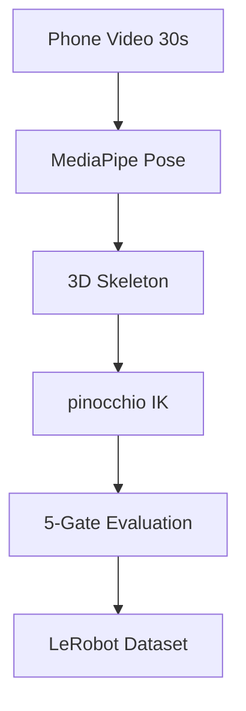

<!-- Original README preserved in docs/README-original.md -->

# 🤖 ロボット転生 (Robot Reincarnation)

**Phone video → Robot policy data. Zero hardware. Zero training.**

---

## The Problem

Robotics and embodied AI are bottlenecked by real-world interaction data. Every human demo costs $1–$5 in teleoperation time. Frontier datasets like AgiBot World (1M trajectories) cost $5M–$15M to produce. The annual global supply of robot manipulation data is orders of magnitude short of what's needed to train general-purpose robots.

## Our Solution

RoboData is a regeneration pipeline that converts 30-second phone videos of human tasks into robot-ready training datasets in LeRobot format. We regenerate the scene from video rather than redacting it — the pipeline extracts 3D skeleton geometry and discards all identity data by construction (no faces, no skin color, no voice, no identifiable environment). This eliminates BIPA/GDPR face-capture liability at the architectural level.



## Screenshots & Demo


[Watch the screen recording of the full upload → run → download flow](https://raw.githubusercontent.com/InNoobWeTrust/aabw-2026/main/docs/pitch/media/Screen%20Recording%202026-07-12%20at%2004.04.43.mov)

## Quick Start (Local Dev)

```bash
# Clone and set up
git clone <repo-url> && cd aabw-2026

# Install dependencies (uv manages the virtual environment automatically)
uv sync --extra dev

# Configure environment
cp .env.example .env
# Edit .env — set JUDGE_ACCESS_PASSWORD, ADMIN_ACCESS_PASSWORD, and JWT_SECRET_KEY

# Run the server (reachable over Tailscale/LAN)
uv run uvicorn backend.server:app --host 0.0.0.0 --reload --port 8000
# or: make dev-lan
# local-only bind: make dev-local

# Run tests
uv run pytest -v

# Generate a synthetic upload sample
make example-video

# Prepare a real recorded/public clip for upload
make prepare-real-video INPUT=/path/to/source.mp4
```

## Example Videos for Testing

### 1. Synthetic sample (easy smoke test)

Generate a known-good MP4 locally:

```bash
make example-video
```

This writes:

```text
data/examples/example_test_video.mp4
```

Use this for:
- upload testing
- queue / status / download flow testing
- quick end-to-end smoke tests

This clip is **not** a valid manipulation demo for real robot training quality evaluation — it is only a synthetic pattern video.

### 2. Real valid manipulation sample (recommended)

The best real test input is a short phone recording you make yourself, because it matches the expected training-data format more closely than stock footage.

**Recommended capture recipe**
- 5–15 seconds
- `.mp4` preferred
- 30 fps
- landscape orientation
- one person only
- full upper body, arms, hands, table, and manipulated object visible
- stable camera (tripod or fixed phone)
- one continuous manipulation task
- plain background if possible

**Good tasks**
- pick up a cup and place it elsewhere
- stack 2–3 blocks
- open a drawer and place an item inside
- move an object from left to right across a table
- pour beans or rice from one container into another

**Avoid**
- fast camera motion
- heavy occlusion of hands
- multiple people in frame
- vertical video if possible
- jump cuts / edited clips
- extreme wide shots where the person is tiny in frame

If you already have a real clip — either self-recorded or downloaded from a public source — convert it into a browser-safe MP4 like this:

```bash
make prepare-real-video INPUT=/path/to/source.mp4
```

This writes:

```text
data/examples/real_capture_prepared.mp4
```

### 3. Public source ideas for real clips

If you do not want to self-record, start from a free public clip source and then run `make prepare-real-video` on the downloaded file.

Examples:
- Pexels search: https://www.pexels.com/search/videos/pick%20and%20place/
- Pexels search: https://www.pexels.com/search/videos/pouring%20coffee/

When choosing a clip, prefer one that satisfies the capture recipe above.

## Environment Variables

| Variable | Description | Default |
|---|---|---|
| `JUDGE_ACCESS_PASSWORD` | Shared password for judge login (anonymous session) | (required) |
| `ADMIN_ACCESS_PASSWORD` | Password for admin login (global visibility) | (required) |
| `ACCESS_PASSWORD` | Legacy fallback for judge password (deprecated) | (none) |
| `JWT_SECRET_KEY` | HMAC secret for signing JWTs | (required) |
| `JWT_EXPIRY_HOURS` | Token lifetime in hours | `24` |
| `MAX_VIDEO_DURATION_SECONDS` | Maximum uploaded video duration | `30` |
| `MAX_VIDEO_SIZE_MB` | Maximum uploaded video file size | `100` |
| `DATA_DIR` | Root directory for all persistent state (`jobs/`, `queue/`) | `./data` |
| `TARGET_ROBOT` | Default robot URDF for IK retargeting | `franka_panda` |
| `HOST` | Server bind address | `0.0.0.0` |
| `PORT` | Server listen port | `8000` |

## Deployment

### Docker

```bash
# Generate the lock file first (required for reproducible Docker builds)
uv lock

# Build and run
docker build -t robodata:latest .
docker run -p 8000:8000 --env-file .env -v $(pwd)/data:/app/data robodata:latest
```

The volume mount at `/app/data` is the canonical persistence path. All job state, queue entries, intermediate artifacts, and output datasets live under `/app/data/jobs/` and `/app/data/queue/`. `DATA_DIR` is set to `/app/data` in the Dockerfile.

### Render

1. Run `uv lock` to generate `uv.lock` (required for the Docker build).
2. Push the image to your registry (`docker push ...`), or connect the repo and let Render build from the Dockerfile.
3. Use the included `render.yaml` for one-click setup. It provisions:
   - A Docker-based Web Service on the Starter plan
   - A 10 GB persistent disk mounted at `/app/data`
   - Environment variables (`DATA_DIR`, `JWT_EXPIRY_HOURS`, etc.)
4. Set `JUDGE_ACCESS_PASSWORD`, `ADMIN_ACCESS_PASSWORD`, and `JWT_SECRET_KEY` as Render env vars (these are marked `sync: false` in render.yaml — they must be entered manually for security).
5. Render uses `$PORT` automatically; the Procfile reads `$PORT`.

## Architecture Overview

The pipeline runs in 6 stages, all orchestrated locally:

1. **Preprocess** (`pipeline/preprocess.py`) — Validate video format, extract frames, normalize resolution
2. **Pose** (`pipeline/pose.py`) — Extract 33 3D landmarks via MediaPipe Pose (YOLO26 fallback)
3. **Retarget** (`pipeline/retarget.py`) — Solve pinocchio IK to map human skeleton to robot joints
4. **Evaluate** (`pipeline/evaluate.py`) — 5-gate scoring (kinematic feasibility, smoothness, task completion, LLM assessment, human review)
5. **Package** (`pipeline/package.py`) — Export to LeRobot format (Parquet episodes + MP4 videos)



## API Endpoints

| Method | Path | Description | Auth |
|---|---|---|---|
| `POST` | `/api/auth/login` | Exchange password for JWT token | No |
| `GET` | `/api/auth/verify` | Verify current token validity (returns role + session) | JWT |
| `POST` | `/api/jobs/upload` | Upload a video for processing (enqueues to FIFO worker) | JWT (any) |
| `GET` | `/api/jobs` | List visible jobs (judge: own; admin: all) | JWT (any) |
| `GET` | `/api/jobs/{job_id}` | Poll pipeline job status | JWT (any) |
| `GET` | `/api/jobs/{job_id}/download` | Download generated LeRobot dataset (.zip) | JWT (any) |
| `DELETE` | `/api/jobs/{job_id}` | Delete a non-running job and its files | JWT (any) |
| `GET` | `/api/admin/jobs` | List all jobs across all sessions | JWT (admin) |
| `GET` | `/api/admin/sessions` | Aggregate job counts grouped by judge session | JWT (admin) |

**Architecture notes:**
- **Single-worker FIFO queue:** Uploads are enqueued via `backend/queue_manager.py` and processed one-at-a-time in arrival order. The `filelock` library provides mutual exclusion around job dispatch.
- **Startup recovery:** On server start, any jobs left in `RUNNING` status (e.g. after a crash) are automatically marked `FAILED` with reason `worker_restarted`. QUEUED jobs are preserved and will be picked up by the pump loop.
- **Session isolation:** Each judge login generates a unique anonymous `judge_session_id`. A judge may have at most one active job at a time. Admin sessions have global visibility across all jobs.
- **No external queue/database:** All persistence is filesystem-based under `data/jobs/` and `data/queue/`.

## Auth Flow

RoboData uses two separate auth channels with role-based JWT tokens:

1. **Judge login**: Send `POST /api/auth/login` with `{"password": "<JUDGE_ACCESS_PASSWORD>"}`
   - Server verifies password with constant-time comparison
   - Returns a JWT containing `role=judge` and a randomly generated `judge_session_id` (UUID)
   - Judge sessions are anonymous — no registration or PII collected
   - A judge can only see, cancel, and delete their own jobs (scoped by `judge_session_id`)

2. **Admin login**: Send `POST /api/auth/login` with `{"password": "<ADMIN_ACCESS_PASSWORD>"}`
   - Returns a JWT with `role=admin` (no `judge_session_id`)
   - Admin sessions have global visibility across all jobs

3. All protected endpoints require `Authorization: Bearer <token>` header
4. Tokens are stateless — validated via HMAC-SHA256 signature, no database needed
5. `GET /api/auth/verify` returns token validity, role, session identity, and expiration
6. Frontend stores token in `localStorage` and includes it in all API calls
7. Expired tokens return 401; wrong role for admin endpoints returns 403

## Tech Stack

| Layer | Tool | Provider | Notes |
|---|---|---|---|
| 3D pose estimation | MediaPipe Pose | Google (local) | 33 3D landmarks, free, Apache 2.0 |
| 2D pose fallback | YOLO26-pose | Replicate | 2D COCO 17-keypoint, ~$0.002/frame |
| Object segmentation | SAM2 | Meta (Replicate) | Video object tracking, ~$0.034/run |
| Object 3D | Hunyuan3D 3.1 | Tencent Cloud | Image-to-3D hosted API, ~$0.30/run |
| Orchestrator agent | Claude / Gemini | AWS Bedrock / Google | Multimodal video analysis |
| Observability | Langfuse | Langfuse | Open-source LLM observability |
| Robot IK solver | pinocchio | INRIA (BSD) | CPU-only, <1s per trajectory |
| Dataset format | LeRobot | HuggingFace | Apache 2.0, 25.7k stars |
| Infrastructure | S3 + Bedrock | AWS | Storage + LLM runtime |

**Pipeline cost:** $0 primary path (MediaPipe local) / ~$0.06–$0.36 with fallback + optional stages

## Built For

[Agentic AI Build Week 2026](https://aabw.genaifund.ai) — July 8–12, HCMC, 2500+ builders, $1M+ prize pool

## Frontend

The frontend is currently dependency-free (static HTML/CSS/JS). If package-managed dependencies are introduced later, `bun` is the preferred package manager.

## License

MIT
