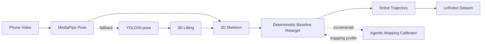
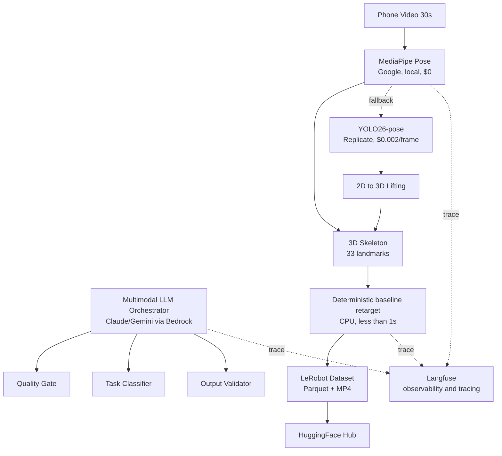

# 🤖 ロボット転生 (Robot Reincarnation)

**Phone video → Robot policy data. Zero hardware. Zero training.**

---

## The Problem

Robotics and embodied AI are bottlenecked by real-world interaction data. Every human demo costs $1–$5 in teleoperation time. Frontier datasets like AgiBot World (1M trajectories) cost $5M–$15M to produce. The annual global supply of robot manipulation data is orders of magnitude short of what's needed to train general-purpose robots.

## Our Solution

RoboData is a regeneration pipeline that converts 30-second phone videos of human tasks into robot-ready training datasets in LeRobot format. We regenerate the scene from video rather than redacting it — the pipeline extracts 3D skeleton geometry and discards all identity data by construction (no faces, no skin color, no voice, no identifiable environment). This eliminates BIPA/GDPR face-capture liability at the architectural level.



## How It Works

1. **Record** — Film a 30-second phone video of any manual task (pouring, wiping, picking, placing)
2. **Upload** — Send it through the hosted pipeline API; the orchestrator agent analyzes video quality, classifies the task, and routes it through the pipeline
3. **Get a dataset** — Download a LeRobot-format dataset ready for policy fine-tuning on any robot (Franka Panda by default)

## Architecture



## Tech Stack

| Layer | Tool | Provider | Notes |
|---|---|---|---|
| 3D pose estimation | MediaPipe Pose | Google (local) | 33 3D landmarks, free, Apache 2.0 |
| 2D pose fallback | YOLO26-pose | Replicate | 2D COCO 17-keypoint, ~$0.002/frame |
| Object segmentation | SAM2 | Meta (Replicate) | Video object tracking, ~$0.034/run |
| Object 3D | Hunyuan3D 3.1 | Tencent Cloud | Image-to-3D hosted API, ~$0.30/run |
| Orchestrator agent | Claude / Gemini | AWS Bedrock / Google | Multimodal video analysis |
| Observability | Langfuse | Langfuse | Open-source LLM observability |
| Robot retarget baseline | Simplified geometric IK today; pinocchio planned/production path | Local CPU | Deterministic baseline, profile-driven |
| Dataset format | LeRobot | HuggingFace | Apache 2.0, 25.7k stars |
| Infrastructure | S3 + Bedrock | AWS | Storage + LLM runtime |

**Pipeline cost:** $0 primary path (MediaPipe local) / ~$0.06–$0.36 with fallback + optional stages

## Why This Matters

- **Free primary pipeline** — $0/video with MediaPipe Pose (vs $1–$5/teleop demo)
- **Privacy by construction** — No faces in output (not blurred — absent). No BIPA/GDPR liability
- **Cross-embodiment** — One video → any robot. Swap the URDF; Franka Panda is the default
- **Zero contributor friction** — Just a phone. No gripper, no wearable, no extra hardware
- **Empty quadrant** — No incumbent in "crowdsourced × robotics-ready" data generation
- **Regulatory moat** — EU AI Act (Aug 2026–27) makes training-data provenance mandatory; our pipeline is identity-free by design
- **Quality-verified output** — 5-gate evaluation (automated metrics + LLM visual assessment + human review) ensures only usable trajectories enter the dataset

## Demo

```bash
# Record a 30s video of someone pouring water
# Run the pipeline (MediaPipe Pose → deterministic baseline retarget → LeRobot)
python -m robodata.pipeline --input pouring.mp4 --robot franka_panda

# Output: LeRobot dataset ready for policy fine-tuning
# → outputs/pouring_franka/ (Parquet + MP4, push to HuggingFace Hub)
```

## Research

- **[Synthesis](docs/synthesis.md)** — Executive decision document (start here)
- **[MVP Pipeline](docs/mvp-pipeline.md)** — MVP pipeline with hosted APIs (hackathon build plan)
- **[Regeneration Pipeline](docs/regeneration-pipeline.md)** — Full regeneration architecture
- **[Current Scene](docs/current-scene.md)** — Data needs, competitive landscape, regulatory backdrop
- **[Capture Tech](docs/capture-tech.md)** — Consumer device sensor capabilities
- **[Problem Statement](docs/problem_statement/Physical%20World%20Data%20Layer.md)** — Original problem statement
- **[Quality Evaluation](docs/quality-evaluation-strategy.md)** — 5-gate evaluation pipeline (automated + LLM + human-in-the-loop)
- **[Agentic Mapping Calibration](docs/specs/agentic-mapping-calibration.md)** — documentation-first plan for bounded agent-assisted retarget correction

## Built For

[Agentic AI Build Week 2026](https://aabw.genaifund.ai) — July 8–12, HCMC, 2500+ builders, $1M+ prize pool

## License

MIT
