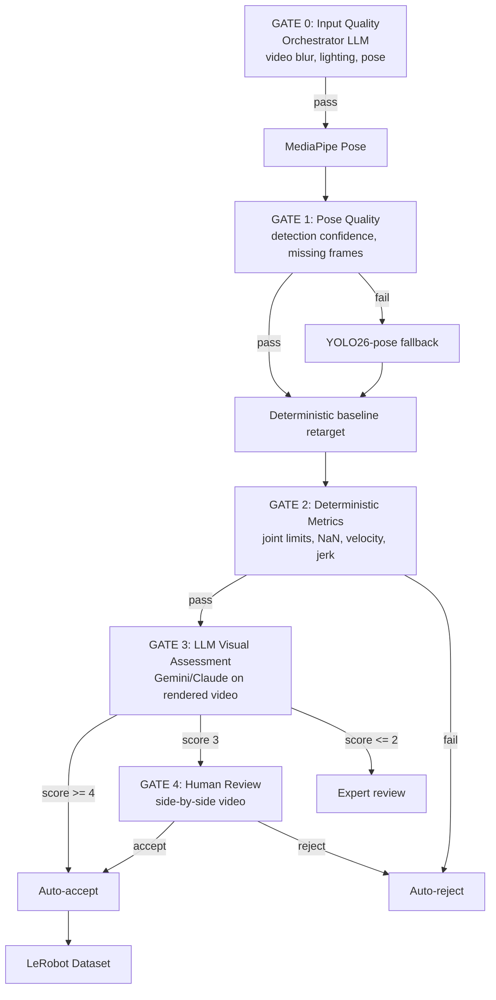

# MVP Pipeline: API-Only Phone-to-Robot Demo

**July 2026** | Hackathon-grade pipeline for Agentic AI Build Week

**Companion documents:**
- `docs/synthesis.md` — executive summary & recommendation
- `docs/regeneration-pipeline.md` — full production architecture (GPU, self-hosted)
- `docs/current-scene.md` — data needs, competitive landscape, regulatory backdrop
- `docs/capture-tech.md` — consumer device sensor capabilities
- `docs/quality-evaluation-strategy.md` — quality evaluation gates (automated + LLM + human review)
- `docs/specs/agentic-mapping-calibration.md` — bounded agent-assisted retarget calibration roadmap

---

## TL;DR

**Phone video → robot policy dataset using MediaPipe Pose (free, local) as primary pose source.** No GPU cluster, no model training, no self-hosted inference for the core artifact path. MediaPipe Pose generates 33 3D landmarks directly from video — no 2D→3D lifting needed. Falls back to YOLO26-pose (Replicate API) when quality is insufficient. The current robot retarget path should now be understood as a **deterministic baseline mapping** that can later be improved by an **agentic mapping calibrator** rather than replaced wholesale. Total API cost: **~$0.03–0.08 for primary path, ~$0.23–0.28 if fallback triggered.**

---

## API Stack

| # | Stage | Tool | Provider | AABW Partner? | Cost/video | Notes |
|---|---|---|---|---|---|---|
| 0 | Agent orchestration | Claude Sonnet / Gemini | AWS Bedrock / Google | Yes | ~$0.01–0.03 | One call per video |
| 1 | Video preprocessing | ffmpeg | Local CPU | — | $0 | Extract frames; <1s |
| 2a | 3D pose estimation (PRIMARY) | MediaPipe Pose | Google (on-device) | Yes (Google) | $0 | 33 3D landmarks directly; no 2D→3D lifting needed |
| 2b | 2D pose estimation (FALLBACK) | `ultralytics/yolo26-pose` | Replicate | No | ~$0.20 | Only if MediaPipe quality insufficient |
| 2c | 2D→3D skeleton lifting (FALLBACK) | Simple Python | Local CPU | — | $0 | Only needed with YOLO fallback |
| 3 | Object segmentation (optional) | SAM2 | Replicate | No | ~$0.034 | Per-video |
| 4 | Object 3D generation (optional) | Hunyuan3D | Tencent Cloud | Yes | ~$0.30–0.60 | 200 free credits |
| 5 | Robot retargeting baseline | Simplified geometric IK (current) / pinocchio + URDF (target) | Local CPU | — | $0 | Deterministic baseline today; profile-driven and calibration-ready |
| 6 | Dataset packaging | LeRobot → HuggingFace Hub | Local CPU | — | $0 | Free HF hosting |
| — | Observability | Langfuse | Langfuse | Yes | $0 (free tier) | All calls traced |

**Primary path (no fallback, no optional): ~$0.03–0.08** (orchestrator + GATE 3)
**With fallback (no optional): ~$0.23–0.28**
**All stages: ~$0.55–1.20**

---

## Pipeline Steps

### Step 0 — Agentic Orchestrator

**Input:** Phone video (≤30s, 720–1080p)
**Process:** Send keyframes to Claude Sonnet (Bedrock) or Gemini with a structured prompt
**Output:** Task classification, quality report, pipeline routing decision
**Compute:** ~1–3s API latency
**Cost:** ~$0.01–0.03/video

The orchestrator is invoked once per video submission. It receives 8 uniformly sampled keyframes
as images + the user's optional text prompt. Responses follow a strict JSON schema (see
"Agentic Orchestrator" section below). Langfuse traces every orchestrator call: input keyframes,
prompt version, output tokens, latency, and pipeline routing decision.

### Step 1 — Video Preprocessing

**Input:** Phone video (.mp4, 720–1080p, 30fps, ≤30s)
**Process:** ffmpeg extracts every 3rd frame → 10fps → 100 frames
**Output:** `frames/0000.jpg` … `frames/0099.jpg`
**Compute:** <1s on any laptop CPU
**Cost:** $0

```bash
ffmpeg -i input.mp4 -vf "select='not(mod(n\,3))',setpts=N/(10*TB)" -q:v 2 frames/%04d.jpg
```

### Step 2 — 3D Pose Estimation (Primary: MediaPipe Pose)

**Input:** Video file (.mp4, 720–1080p, 30fps, ≤30s)
**Process:** MediaPipe Pose processes video frame-by-frame. Returns 33 3D landmarks per frame in a normalized coordinate system (relative to hip center). No 2D→3D lifting needed — MediaPipe does this internally using a lightweight ML model.
**Output:** `[T × 33 × 3]` 3D landmark positions (x, y, z in meters, hip-centered)
**Compute:** ~30ms/frame on CPU; ~3s total for 100 frames
**Cost:** $0 (Apache 2.0, runs locally)

```python
import mediapipe as mp
import cv2

mp_pose = mp.solutions.pose
pose = mp_pose.Pose(
    static_image_mode=False,
    model_complexity=2,  # highest accuracy
    min_detection_confidence=0.5,
    min_tracking_confidence=0.5,
)

def extract_3d_pose(video_path):
    """Extract 3D pose landmarks from video using MediaPipe."""
    cap = cv2.VideoCapture(video_path)
    landmarks_all = []

    while cap.isOpened():
        ret, frame = cap.read()
        if not ret:
            break

        rgb = cv2.cvtColor(frame, cv2.COLOR_BGR2RGB)
        results = pose.process(rgb)

        if results.pose_world_landmarks:
            lm = results.pose_world_landmarks.landmark
            # 33 landmarks, each with x, y, z (meters, hip-centered)
            landmarks = np.array([[l.x, l.y, l.z] for l in lm])
            landmarks_all.append(landmarks)
        else:
            landmarks_all.append(None)  # detection failed

    cap.release()
    return np.array([l for l in landmarks_all if l is not None])  # [T × 33 × 3]
```

**MediaPipe 33-landmark reference:**

| Index | Landmark | Index | Landmark |
|---|---|---|---|
| 0 | Nose | 17 | Left pinky |
| 1 | Left eye (inner) | 18 | Right pinky |
| 2 | Left eye | 19 | Left index |
| 3 | Left eye (outer) | 20 | Right index |
| 4 | Right eye (inner) | 21 | Left thumb |
| 5 | Right eye | 22 | Right thumb |
| 6 | Right eye (outer) | 23 | Left hip |
| 7 | Left ear | 24 | Right hip |
| 8 | Right ear | 25 | Left knee |
| 9 | Left mouth | 26 | Right knee |
| 10 | Right mouth | 27 | Left ankle |
| 11 | Left shoulder | 28 | Right ankle |
| 12 | Right shoulder | 29 | Left heel |
| 13 | Left elbow | 30 | Right heel |
| 14 | Right elbow | 31 | Left foot index |
| 15 | Left wrist | 32 | Right foot index |
| 16 | Right wrist | | |

Key joints for robot retargeting: **LEFT_WRIST (15)**, **RIGHT_WRIST (16)**, **LEFT_ELBOW (13)**, **RIGHT_ELBOW (14)**. These are the core landmarks for the current deterministic baseline and the future profile-driven calibration flow.

#### Fallback: YOLO26-pose + 2D→3D Lifting

MediaPipe may fail when: motion blur, heavy occlusion, side-facing (>45°), or multiple people overlapping. The orchestrator agent detects quality issues and triggers the fallback path.

**Input:** 100 keyframe images (720–1080p)
**API:** Replicate `ultralytics/yolo26-pose`
**Process:** Send each frame individually (or batched via concurrent requests). YOLO26-pose returns
COCO 17-keypoint format: nose, eyes, ears, shoulders, elbows, wrists, hips, knees, ankles.
**Output:** `[T × 17 × 2]` 2D pixel coordinates + confidence per joint
**Compute:** ~0.5–1s/frame on Replicate CPU; 50–100s total with 8 parallel requests
**Cost:** ~0.002 USD/frame × 100 frames = **~$0.20**

```python
import replicate

def extract_2d_pose(frame_path: str) -> dict:
    output = replicate.run(
        "ultralytics/yolo26-pose:8ba52e1f939cae8f3faba0e80f7dab58cc1dc414bdc664a0f6b9b8475e9bfd37",
        input={"image": open(frame_path, "rb")}
    )
    # output: list of COCO 17-keypoint dicts (one per detected person)
    return output

# Run concurrently for all frames
from concurrent.futures import ThreadPoolExecutor
with ThreadPoolExecutor(max_workers=8) as executor:
    all_poses = list(executor.map(extract_2d_pose, frame_paths))
```

**COCO 17-keypoint indices:**

| Index | Joint | Index | Joint |
|---|---|---|---|
| 0 | Nose | 9 | Left knee |
| 1 | Left eye | 10 | Right knee |
| 2 | Right eye | 11 | Left ankle |
| 3 | Left ear | 12 | Right ankle |
| 4 | Right ear | 13 | (left head) |
| 5 | Left shoulder | 14 | (right head) |
| 6 | Right shoulder | 15 | (left foot) |
| 7 | Left elbow | 16 | (right foot) |
| 8 | Right elbow |    | |

### Step 3 — 2D→3D Skeleton Lifting (Fallback Only)

> **This step is only needed when using the YOLO26-pose fallback (Step 2b/2c). When using MediaPipe Pose (Step 2a), skip directly to Step 5 (Robot IK Retargeting) — MediaPipe outputs 3D landmarks directly.**

**Input:** `[T × 17 × 2]` 2D pixel coordinates from Step 2
**Process:** Simple perspective projection inverse using known human bone-length ratios from
anthropometric data. Assumes camera at ~2m distance, 60° HFOV. Normalizes skeleton to standard
human height (1.7m).

**Algorithm:**

1. Assume pinhole camera with focal length `f = w / (2 × tan(HFOV/2))`
2. For a 2D point `(u, v)` with known real-world depth `Z`, 3D is `(X, Y, Z)` where:
   `X = (u - cx) × Z / f`, `Y = (v - cy) × Z / f`
3. Depth `Z` for pelvis is assumed (~2m). Other joint depths propagated using bone-length ratios.
4. Bone-length ratios from anthropometric tables (DIN 33402, Winter 2009):

```python
ANTHROPOMETRIC_RATIOS = {
    # Bone segment : percentage of total height
    "torso": 0.288,       # hip → shoulder
    "upper_arm": 0.186,   # shoulder → elbow
    "forearm": 0.146,     # elbow → wrist
    "hand": 0.108,        # wrist → fingertip (partial)
    "upper_leg": 0.245,   # hip → knee
    "lower_leg": 0.246,   # knee → ankle
}

def lift_2d_to_3d(pose_2d, frame_width, frame_height, hfov_deg=60, camera_dist_m=2.0):
    """Lift COCO 17-keypoint 2D pose to approximate 3D positions.
    
    Uses perspective projection inverse + anthropometric bone ratios.
    Assumes single person, standing ~2m from camera, 60° HFOV.
    """
    import numpy as np
    
    cx, cy = frame_width / 2, frame_height / 2
    f = frame_width / (2 * np.tan(np.radians(hfov_deg / 2)))
    
    COCO_SKELETON = [
        (5, 6),   # shoulders
        (5, 7), (7, 9),   # left arm: shoulder → elbow → wrist
        (6, 8), (8, 10),  # right arm
        (5, 11), (11, 13), # left leg: shoulder → hip → knee
        (6, 12), (12, 14), # right leg
    ]
    
    # Use COCO indices: 5=left shoulder, 6=right shoulder, 11=left hip, 12=right hip
    total_h = 1.7  # assumed human height in meters
    pelvis_center_2d = np.mean([pose_2d[11, :2], pose_2d[12, :2]], axis=0)
    Z_pelvis = camera_dist_m
    
    # Pelvis 3D
    pelvis_3d = np.array([
        (pelvis_center_2d[0] - cx) * Z_pelvis / f,
        (pelvis_center_2d[1] - cy) * Z_pelvis / f,
        Z_pelvis
    ])
    
    # Propagate to all joints using bone ratios + pixel displacement as depth delta
    joints_3d = np.zeros((17, 3))
    joints_3d[11] = [(pose_2d[11, 0] - cx) * Z_pelvis / f,
                      (pose_2d[11, 1] - cy) * Z_pelvis / f, Z_pelvis]
    joints_3d[12] = [(pose_2d[12, 0] - cx) * Z_pelvis / f,
                      (pose_2d[12, 1] - cy) * Z_pelvis / f, Z_pelvis]
    
    shoulder_mid_3d = np.copy(joints_3d[11])  # approx; refine with torso ratio
    shoulder_mid_3d[1] -= ANTHROPOMETRIC_RATIOS["torso"] * total_h  # up in image = down in world
    
    joints_3d[5] = np.copy(shoulder_mid_3d)  # left shoulder
    joints_3d[6] = np.copy(shoulder_mid_3d)  # right shoulder
    
    # Arms: propagate from shoulder
    for side, (shoulder, elbow, wrist) in [("left", (5, 7, 9)), ("right", (6, 8, 10))]:
        sh = joints_3d[shoulder]
        e_2d = pose_2d[elbow, :2]
        e_3d = np.array([(e_2d[0] - cx) * Z_pelvis / f,
                          (e_2d[1] - cy) * Z_pelvis / f, Z_pelvis])
        dir_elbow = e_3d - sh
        dir_elbow = dir_elbow / (np.linalg.norm(dir_elbow) + 1e-8)
        joints_3d[elbow] = sh + dir_elbow * ANTHROPOMETRIC_RATIOS["upper_arm"] * total_h
        
        el = joints_3d[elbow]
        w_2d = pose_2d[wrist, :2]
        w_3d = np.array([(w_2d[0] - cx) * Z_pelvis / f,
                          (w_2d[1] - cy) * Z_pelvis / f, Z_pelvis])
        dir_wrist = w_3d - el
        dir_wrist = dir_wrist / (np.linalg.norm(dir_wrist) + 1e-8)
        joints_3d[wrist] = el + dir_wrist * ANTHROPOMETRIC_RATIOS["forearm"] * total_h
    
    # Legs: propagate from pelvis hip joints
    for side, (hip, knee, ankle) in [("left", (11, 13, 15)), ("right", (12, 14, 16))]:
        hp = joints_3d[hip]
        k_2d = pose_2d[knee, :2]
        k_3d = np.array([(k_2d[0] - cx) * Z_pelvis / f,
                          (k_2d[1] - cy) * Z_pelvis / f, Z_pelvis])
        dir_knee = k_3d - hp
        dir_knee = dir_knee / (np.linalg.norm(dir_knee) + 1e-8)
        joints_3d[knee] = hp + dir_knee * ANTHROPOMETRIC_RATIOS["upper_leg"] * total_h
        
        kn = joints_3d[knee]
        a_2d = pose_2d[ankle, :2]
        a_3d = np.array([(a_2d[0] - cx) * Z_pelvis / f,
                          (a_2d[1] - cy) * Z_pelvis / f, Z_pelvis])
        dir_ankle = a_3d - kn
        dir_ankle = dir_ankle / (np.linalg.norm(dir_ankle) + 1e-8)
        joints_3d[ankle] = kn + dir_ankle * ANTHROPOMETRIC_RATIOS["lower_leg"] * total_h
    
    return joints_3d  # [17 × 3]
```

**Output:** `[T × 17 × 3]` approximate 3D joint positions in meters, pelvis-centered coordinate frame.
**Limitations:** Perspective-only; ignores occlusion, multiple people, and non-frontal poses. Sufficient
for single-arm retargeting of a person facing the camera within ±30° rotation. Not suitable for
bimanual tasks or sideways-facing capture.

### Step 4 — Object Detection (Optional)

**Input:** Video frames
**API:** Replicate SAM2 image segmentation
**Process:** Send a frame with a point prompt on a detected object (YOLO bounding box from Step 2,
or orchestrator-identified object). SAM2 generates a mask.
**Output:** Object mask → cropped object image for Hunyuan3D
**Compute:** ~2–5s per segment on Replicate GPU
**Cost:** ~$0.034/video

```python
import replicate

def segment_object(frame_path: str, point_prompt: tuple) -> bytes:
    output = replicate.run(
        "meta/sam-2:...",  # SAM2 model slug on Replicate
        input={
            "image": open(frame_path, "rb"),
            "point_coords": [point_prompt],
            "point_labels": [1],  # 1 = foreground
        }
    )
    # output: mask + cropped object
    return output["mask"]
```

**Skip conditions:** Object segmentation is optional for the MVP. If the task is a pushing/sliding
task (no object grasp/release), skip. If the task involves pick-and-place, include to generate
object meshes.

### Step 5 — Object 3D Generation (Optional)

**Input:** Cropped object image from Step 4
**API:** Tencent Cloud Hunyuan3D `SubmitHunyuanTo3DProJob`
**Process:** POST object image → poll job status → download .glb mesh
**Output:** 3D mesh of the manipulated object (cup, pitcher, box, etc.)
**Compute:** ~30–120s async on Tencent Cloud GPU
**Cost:** ~$0.30–0.60/run (200 free credits on activation)
**AutoRigging:** 10 additional credits for skeleton rigging

```python
# Pseudocode — actual Tencent Cloud SDK integration
from tencentcloud.common import credential
from tencentcloud.hunyuan3d.v20240801 import hunyuan3d_client, models

client = hunyuan3d_client.Hunyuan3dClient(credential, region)

req = models.SubmitHunyuanTo3DProJobRequest()
req.ImageUrl = object_image_url
resp = client.SubmitHunyuanTo3DProJob(req)
job_id = resp.JobId

# Poll until complete
while True:
    status_req = models.QueryHunyuanTo3DProJobRequest()
    status_req.JobId = job_id
    status = client.QueryHunyuanTo3DProJob(status_req)
    if status.Status == "SUCCESS":
        download_url = status.Output.MeshUrl  # .glb file
        break
    time.sleep(2)
```

**AABW note:** This is the only 3D asset pipeline available from an AABW partner. Tencent Cloud
provides 200 free credits on activation — enough for 300–600 object generations during the
hackathon. Endpoint: `hunyuan.intl.tencentcloudapi.com`.

### Step 6 — Robot IK Retargeting Baseline (Local CPU)

**Input:** `[T × N × 3]` 3D skeleton from Step 2 (MediaPipe: 33 landmarks; fallback: 17 joints from Step 3), target robot URDF
**Process:** Apply a deterministic baseline human→robot mapping, then solve IK to produce a robot joint trajectory.
**Output:** `[T × 7]` Franka Panda joint angles (or `[T × J]` for any robot)
**Compute:** <1s total on CPU for the current simplified geometric baseline; pinocchio remains the intended stronger solver path
**Cost:** $0

> **Important:** This step should be treated as the **baseline mapping pass**, not the final product architecture. The roadmap now includes an **agentic mapping calibrator** that inspects sampled source/overlay/skeleton/simulation evidence, proposes a structured `mapping_profile`, and triggers a calibrated deterministic rerun. See `docs/specs/agentic-mapping-calibration.md`.

```python
import pinocchio as pin
import numpy as np
from pathlib import Path

def retarget_wrist_to_panda(skeleton_3d, urdf_path, wrist_joint_idx=15, source="mediapipe"):
    """Retarget skeleton wrist trajectory to Franka Panda joint angles.

    Args:
        skeleton_3d: [T × N × 3] 3D joint positions
            - MediaPipe: [T × 33 × 3], coordinates in meters, hip-centered
            - YOLO+lifting: [T × 17 × 3], COCO format, approximate
        urdf_path: Path to Franka Panda URDF
        wrist_joint_idx: Landmark index for wrist
            - MediaPipe: 15 (LEFT_WRIST) or 16 (RIGHT_WRIST)
            - COCO: 9 (left) or 10 (right)
        source: "mediapipe" or "coco" — determines coordinate transform

    Returns:
        joint_angles: [T × 7] Franka Panda joint trajectory
    """
    model = pin.buildModelFromUrdf(str(urdf_path))
    data = model.createData()

    EE_FRAME_ID = model.getFrameId("panda_hand")  # end-effector frame name in URDF

    T = len(skeleton_3d)
    joint_angles = np.zeros((T, 7))

    for t in range(T):
        wrist_3d = skeleton_3d[t, wrist_joint_idx]  # [x, y, z]

        # Transform wrist to robot base frame
        if source == "mediapipe":
            # MediaPipe: X=right, Y=down, Z=toward camera (meters, hip-centered)
            # Robot: X=forward, Y=left, Z=up
            ee_target = np.array([
                -wrist_3d[2],    # -Z → robot forward
                -wrist_3d[0],    # -X → robot left
                -wrist_3d[1],    # -Y → robot up
            ])
        else:
            # COCO: pelvis-centered, approximate meters
            # Skeleton Z=forward (from camera), robot Z=up
            ee_target = np.array([
                wrist_3d[0],     # left/right
                wrist_3d[2],     # depth → robot vertical
                wrist_3d[1],     # height → robot forward
            ])

        # Apply scale: human arm reach ~0.7m, Panda reach ~0.855m
        scale = 0.855 / 0.7
        ee_target *= scale

        # Identity orientation (pointing down for grasp)
        ee_rot = pin.Quaternion.FromTwoVectors(
            np.array([0, 0, -1]),  # default gripper direction
            np.array([0, 0, -1])   # keep downward
        )

        # Start from nominal joint configuration
        q0 = np.array([0, -0.4, 0, -2.0, 0, 2.0, 0.78])

        # IK solve
        oMdes = pin.SE3(ee_rot.toRotationMatrix(), ee_target)

        q_sol = q0.copy()
        for _ in range(200):  # max iterations
            pin.framesForwardKinematics(model, data, q_sol)
            oMi = data.oMf[EE_FRAME_ID]
            err = pin.log(oMi.inverse() * oMdes).vector

            if np.linalg.norm(err) < 1e-4:
                break

            J = pin.computeFrameJacobian(model, data, q_sol, EE_FRAME_ID)
            J_pinv = np.linalg.pinv(J)
            q_sol += J_pinv @ err

            # Clamp to Panda joint limits
            q_sol = np.clip(q_sol,
                [-2.8973, -1.7628, -2.8973, -3.0718, -2.8973, -0.0175, -2.8973],
                [ 2.8973,  1.7628,  2.8973, -0.0698,  2.8973,  3.7525,  2.8973])

        joint_angles[t] = q_sol

    return joint_angles
```

### Step 6b — Agentic Mapping Calibration (Incremental Add-on)

**Status:** planned incremental upgrade, not part of the original static MVP

**Input:**
- baseline robot trajectory and simulation from Step 6,
- sampled original frames,
- sampled skeleton overlay / skeleton preview frames,
- compact pose metrics,
- compact retarget metrics,
- baseline mapping assumptions.

**Process:** A bounded agent running via **Featherless + Daytona** behaves like a human mapping calibrator. It does **not** generate the full joint trajectory. Instead it:
1. inspects compact evidence,
2. proposes a structured `mapping_profile`,
3. optionally emits sparse correction anchors,
4. recommends whether to rerun deterministic retargeting or preserve skeleton-only export.

**Output:**
- `mapping_profile.json`
- `decision.json`
- optional sparse correction anchors
- calibrated retarget rerun request

**Why this is incremental:**
- deterministic baseline remains the source of truth,
- calibration is bounded and reproducible,
- baseline and calibrated outputs can be compared side-by-side,
- the system remains useful even when the agent is unavailable.

### Step 7 — Dataset Packaging (Local CPU)

**Input:** `[T × 7]` joint trajectory from Step 6, original video
**Process:** Convert to LeRobot format (Parquet + MP4), push to HuggingFace Hub
**Output:** LeRobot v2.1 dataset compatible with ACT, Diffusion Policy, Octo, etc.
**Compute:** <2s on laptop CPU
**Cost:** $0 (HuggingFace Hub free tier)

```python
import pandas as pd
from pathlib import Path

def package_lerobot(joint_trajectory, output_dir, episode_metadata):
    """Package joint trajectory as LeRobot v2.1 dataset."""
    output_dir = Path(output_dir)
    output_dir.mkdir(parents=True, exist_ok=True)
    
    T = len(joint_trajectory)
    
    df = pd.DataFrame({
        "observation.state": [joint_trajectory[t].tolist() for t in range(T)],
        "action": [joint_trajectory[t + 1].tolist() if t < T - 1
                   else joint_trajectory[t].tolist() for t in range(T)],
        "episode_index": [0] * T,
        "frame_index": list(range(T)),
        "timestamp": [t / 10.0 for t in range(T)],  # 10fps
    })
    
    df.to_parquet(output_dir / "episode_000000.parquet")
    
    # Copy video as observation.images.cam_high
    meta = {
        "fps": 10,
        "robot_type": "franka_panda",
        "episodes": 1,
        "total_frames": T,
        "metadata": episode_metadata,
    }
    import json
    (output_dir / "meta.json").write_text(json.dumps(meta, indent=2))
    
    print(f"LeRobot dataset written to {output_dir}")
    # Push to HuggingFace Hub:
    # huggingface-cli upload <user>/<dataset> {output_dir} .
```

---

## Quality Evaluation Gates

> Full strategy: `docs/quality-evaluation-strategy.md`

Every trajectory passes through 5 gates before entering the LeRobot dataset. Gates 0–2 are automated ($0, <1s). Gate 3 uses an LLM ($0.02–0.05, 3–8s). Gate 4 is human review (only when flagged).



### Gate summary table:

| Gate | What | Method | Cost | Trigger |
|---|---|---|---|---|
| 0 | Input quality | Orchestrator LLM (existing) | $0.01–0.03 | Every video |
| 1 | Pose quality | MediaPipe confidence + missing frame % | $0 | Every video |
| 2 | Trajectory quality | Joint velocity, jerk, limits, NaN, completeness | $0 | Every trajectory |
| 3 | Visual assessment | Gemini/Claude on rendered trajectory video | $0.02–0.05 | Every trajectory that passes G2 |
| 4 | Human review | Side-by-side video UI | Human time | Only when G3 score = 3 |

### Auto-disposition logic:

| G2 Metrics | G3 LLM Score | Disposition |
|---|---|---|
| All green | >= 4 | **Auto-accept** (~60–70%) |
| All green | 3 | **Quick human review** (~20–30%) |
| Any yellow | Any | **Expert review** (~5–10%) |
| Any red | — | **Auto-reject** (~1–3%) |

---

## Agentic Orchestrator

A single multimodal LLM call (Claude Sonnet via AWS Bedrock, or Gemini) coordinates the entire
pipeline. The agent receives 8 uniformly sampled keyframes from the input video and returns a
structured JSON decision document.

### What the Orchestrator Does

1. **Task classification** — "pouring task with glass and pitcher, right-handed, single-arm"
2. **Quality gate** — "frame 45–58 has motion blur; recommend re-record if wrist tracking fails"
3. **Pipeline routing** — "use Franka Panda for single-arm right-handed manipulation; skip object
   segmentation (no rigid object grasp)"
4. **Output validation** — "dataset produced: 300 frames at 10fps, quality score 0.85"

### Structured Output Schema

```json
{
  "task": {
    "classification": "pour-liquid",
    "handedness": "right",
    "manipulation_type": "single-arm",
    "objects_involved": ["glass", "pitcher"],
    "confidence": 0.92
  },
  "quality": {
    "score": 0.85,
    "issues": [
      {
        "type": "motion_blur",
        "frames": [45, 46, 47, 48, 49, 50, 51, 52, 53, 54, 55, 56, 57, 58],
        "severity": "medium",
        "recommendation": "re-record if wrist tracking fails"
      }
    ],
    "pass_gate": true
  },
  "pipeline": {
    "target_robot": "franka_panda",
    "pose_source": "mediapipe",  // or "yolo26_fallback"
    "wrist_joint_idx": 15,
    "skip_object_segmentation": true,
    "skip_3d_object_generation": true,
    "estimated_total_cost": 0.02
  },
  "validation": {
    "frame_count": 300,
    "fps": 10,
    "duration_seconds": 30.0,
    "tracked_joints": 33,
    "missing_frames": 0,
    "overall_quality": 0.85
  }
}
```

### MediaPipe Quality Gates

MediaPipe Pose runs locally and returns confidence values per landmark. The orchestrator evaluates
these metrics to decide whether to trigger the YOLO fallback:

- **Detection confidence < 0.5 for >10% of frames** → trigger fallback
- **Missing frames > 5%** (pose_world_landmarks absent) → trigger fallback
- **Landmark jitter > threshold** (inter-frame wrist displacement > 5cm) → apply smoothing or trigger fallback

When all gates pass, the primary MediaPipe path runs with $0 cost and direct 3D output, skipping
Steps 2b/2c entirely.

### Langfuse Integration

```python
from langfuse import Langfuse

langfuse = Langfuse(public_key, secret_key)

trace = langfuse.trace(
    name="pipeline-run",
    metadata={"video_id": "abc123", "duration_s": 30}
)

span_orch = trace.span(name="orchestrator", input={"keyframes": [urls]})
orch_output = call_bedrock(prompt, keyframes)
span_orch.end(output=orch_output)

span_pose = trace.span(name="pose-estimation", input={"frames": 100})
poses = extract_all_poses(frames)
span_pose.end(output={"poses_extracted": len(poses)})

span_ik = trace.span(name="ik-retargeting", input={"frames": 100})
joints = retarget_wrist_to_panda(poses_3d, URDF_PATH)
span_ik.end(output={"joint_trajectory_shape": joints.shape})

trace.update(output={"quality_score": orch_output["validation"]["overall_quality"]})
```

---

## Demo Walkthrough

### Scripts

```
scripts/
├── extract_frames.py        # Step 1: Video preprocessing
├── orchestrate.py           # Step 0: GATE 0 — LLM quality gate
├── pose_3d.py               # Step 2: MediaPipe Pose → GATE 1 (pose quality)
├── retarget.py              # Step 6: deterministic baseline retarget
├── calibrate_mapping.py     # Step 6b: planned agentic mapping calibration
├── evaluate_metrics.py      # GATE 2: Deterministic metrics
├── evaluate_llm.py          # GATE 3: LLM visual assessment
├── review_server.py         # GATE 4: Human review UI (Streamlit)
└── package.py               # Step 7: LeRobot packaging
```

### Prerequisites

```bash
pip install mediapipe replicate python-pinocchio pandas opencv-python huggingface_hub langfuse
brew install ffmpeg pinocchio  # macOS
```

Set environment variables:

```bash
export REPLICATE_API_TOKEN="r8_..."
export LANGFUSE_PUBLIC_KEY="pk-..."
export LANGFUSE_SECRET_KEY="sk-..."
export TENCENT_SECRET_ID="..."
export TENCENT_SECRET_KEY="..."
export AWS_ACCESS_KEY_ID="..."       # for Bedrock
export AWS_SECRET_ACCESS_KEY="..."
```

### Step-by-Step

```bash
# 1. Record 30s phone video (pouring water, wiping table, picking a cup)
#    → input.mp4

# 2. Extract keyframes
python scripts/extract_frames.py --input input.mp4 --fps 10 --output frames/

# 3. Orchestrator: classify task, quality gate, route pipeline
python scripts/orchestrate.py --frames frames/ --output routing.json

# 3. 3D pose estimation (MediaPipe, free, local)
python scripts/pose_3d.py --video input.mp4 --output poses_3d.npy

# 3b. (Fallback only) 2D pose via Replicate + 3D lifting
# python scripts/pose_2d.py --frames frames/ --output poses_2d.npy
# python scripts/lift_3d.py --poses poses_2d.npy --output poses_3d.npy

# 4. Robot retargeting baseline (local CPU, deterministic)
python scripts/retarget.py --poses poses_3d.npy --urdf assets/franka_panda.urdf \
    --output joints.npy --wrist-idx 15 --source mediapipe

# 4b. Quality metrics (GATE 2)
python scripts/evaluate_metrics.py --joints joints.npy --urdf assets/franka_panda.urdf \
    --output metrics.json

# 4c. LLM visual assessment (GATE 3)
python scripts/evaluate_llm.py --joints joints.npy --video input.mp4 \
    --output evaluation.json

# 5. Dataset packaging → HuggingFace Hub
python scripts/package.py --joints joints.npy --video input.mp4 \
    --dataset my-org/pouring-task-demo --output output/

# Done: output/ contains LeRobot-format dataset
# HuggingFace Hub: https://huggingface.co/datasets/my-org/pouring-task-demo
```

### What the Output Looks Like

```
output/
├── meta.json                          # episode metadata
├── observation.images.cam_high.mp4    # original video (10fps)
├── episode_000000.parquet             # [state (7), action (7), timestamps]
└── stats.json                         # min/max/mean per joint
```

`meta.json`:
```json
{
  "fps": 10,
  "robot_type": "franka_panda",
  "episodes": 1,
  "total_frames": 300,
  "tasks": ["pour-liquid right-handed glass+pitcher"],
  "quality_score": 0.85,
  "pipeline_version": "mvp-v1",
  "generated_at": "2026-07-10T12:00:00Z"
}
```

`episode_000000.parquet` schema:
```
observation.state:  float32[7]   (joint positions in radians)
action:             float32[7]   (next-frame joint positions)
episode_index:      int32
frame_index:        int32
timestamp:          float32      (seconds)
```

---

## Cost Analysis

### Per-Video Breakdown

| Stage | Provider | Cost (USD) | Billed Unit | Free Tier? |
|---|---|---|---|---|
| Orchestrator (Claude Sonnet) | AWS Bedrock | $0.01–0.03 | Per 1K tokens | $0 if free credits |
| ffmpeg keyframe extraction | Local | $0.00 | — | — |
| MediaPipe Pose (PRIMARY) | Google (on-device) | $0.00 | — | Apache 2.0 |
| YOLO26-pose (FALLBACK, 100 frames) | Replicate | $0.20 | ~$0.002/frame | No |
| 2D→3D lifting (FALLBACK) | Local CPU | $0.00 | — | — |
| SAM2 object segmentation | Replicate | $0.034 | Per run | No |
| Hunyuan3D mesh generation | Tencent Cloud | $0.30–0.60 | Per job | 200 free credits |
| pinocchio IK retargeting | Local CPU | $0.00 | — | — |
| LLM trajectory evaluation (GATE 3) | Google Gemini / AWS Bedrock | $0.02–0.05 | Per trajectory | $0 if free credits |
| LeRobot packaging + HF push | Local CPU | $0.00 | — | Free HF tier |
| Langfuse observability | Langfuse | $0.00 | Monthly traces | 50K free/month |

### Total per 30s Video

| Scenario | Cost |
|---|---|
| Primary (MediaPipe, no optional) | **~$0.03–0.08** (orchestrator + GATE 3) |
| With YOLO fallback (no optional) | **~$0.23–0.28** |
| Full pipeline (all stages) | **~$0.55–1.20** |
| 100 videos (minimal) | **~$23–28** |
| 100 videos (full) | **~$55–120** |
| 1,000 videos (full, post-free-credits) | **~$550–1,200** |

### Hackathon Budget

| Resource | Allocation | Cost |
|---|---|---|
| Replicate credit (seed) | $5 free on signup | $0 |
| Tencent Cloud Hunyuan3D | 200 free credits on activation | $0 |
| AWS Bedrock (free tier) | ~$0.01/call × 50 videos | ~$0.50 |
| Langfuse | Free tier (50K traces/month) | $0 |
| HuggingFace Hub | Free tier (unlimited public datasets) | $0 |
| **Total out-of-pocket** | | **~$0.50** |

---

## Feasibility Assessment

### What's Truly Hosted (API-Only)

| Capability | Hosted? | Provider | Production-Ready? |
|---|---|---|---|
| 3D pose estimation | Yes (local) | Google MediaPipe Pose | Yes (Apache 2.0) |
| 2D pose estimation | Yes | Replicate YOLO26-pose | Yes |
| Object segmentation | Yes | Replicate SAM2 | Yes |
| 3D object mesh generation | Yes | Tencent Hunyuan3D | Yes (image-to-3D) |
| Multimodal orchestration | Yes | AWS Bedrock / Google Gemini | Yes |

### What Must Be Local (No Hosted Equivalent)

| Capability | Local Tool | Why No API Exists |
|---|---|---|
| 3D pose estimation | MediaPipe Pose (on-device) | Free, local; primary path — no API needed |
| 2D→3D skeleton lifting (fallback) | ~50 lines Python | Only needed if YOLO fallback triggered |
| Robot IK retargeting | pinocchio (BSD) | Per-robot URDF; no general cloud IK service exists |
| Video preprocessing | ffmpeg | Just extract frames; no API needed |
| LeRobot packaging | Python + Parquet | Simple file format; no API needed |

### Key Gaps vs Production Pipeline

| Gap | MVP Approach | Production Approach |
|---|---|---|
| 3D skeleton quality | MediaPipe Pose (±5–10cm depth error, hip-relative) | HybrIK-X SMPL-X (sub-cm, MIT license) |
| Scene reconstruction | None (MVP skips) | COLMAP + 3DGS or RoomPlan |
| Multi-person handling | Assume single person | PHALP tracking + person re-ID |
| Bimanual tasks | Not supported | Dual IK chain → dual-arm robot |
| Robot POV rendering | Not in MVP | NVIDIA Kaolin photorealistic rendering |
| Privacy (structural) | No visual data leaves device in primary path (MediaPipe runs local) | Full regeneration pipeline (see `regeneration-pipeline.md`) |
| Object state tracking | None | FoundationPose 6-DoF |
| Physics validation | None | MuJoCo/Isaac Sim sim rollout |

### What Actually Works (Hackathon Realistic)

- Single-arm pick-and-place, pouring, wiping, pushing with person facing camera
- 100–300 frame trajectory output at 10fps
- LeRobot-compatible Parquet files loadable in ACT, Diffusion Policy, Octo training loops
- Object meshes via Hunyuan3D (if optional stages included)
- Full observability via Langfuse dashboard

### What Won't Work (Don't Promise)

- Bimanual tasks (two-handed pouring, two-arm assembly)
- Tasks where wrists are occluded for >10 frames
- Fine manipulation (threading, peg-in-hole) — YOLO keypoint precision insufficient
- Multi-person scenes
- Side-facing or >45° rotated capture
- Real-time streaming — this is a batch pipeline
- Trained policies — we produce datasets, not trained VLAs

---

## AABW Partner Integration Map

| AABW Partner | Pipeline Stage(s) | Integration Type | Status |
|---|---|---|---|
| **AWS** | Orchestrator (Bedrock), storage (S3) | Claude Sonnet API + S3 SDK | Ready |
| **Tencent Cloud** | Object 3D generation (Hunyuan3D) | `SubmitHunyuanTo3DProJob` API | Ready (200 free credits) |
| **Google for Developers** | Orchestrator (alternative), pose estimation (MediaPipe Pose) | Gemini API + MediaPipe Python SDK | Ready |
| **Langfuse** | Observability across all stages | Python SDK + dashboard | Ready (free tier) |
| **Featherless** | Not used | Serverless GPU for LLMs only; no CV models | N/A |
| **HuggingFace** (non-partner) | Dataset hosting + LeRobot format | Hub API + `huggingface_hub` | Ready (free tier) |
| **Replicate** (non-partner) | Pose estimation, object segmentation | REST API + Python SDK | Ready (seed credits) |

### Partners Evaluated but Not Used

| Partner | Why Not Used |
|---|---|
| BytePlus | 3D Limbs SDK is on-device (C/Java), not a cloud API; Vision AI is generative only |
| Agora | ConvoAI is audio/voice only; no vision or CV APIs |
| Kimi (Moonshot) | LLM only (K2.6); no multimodal vision for keyframe analysis |
| Microsoft for Startups | Azure credits available but no unique capability for this pipeline |
| Daytona | Cloud dev environments; not a pipeline API |
| ClickHouse | Real-time analytics; overkill for MVP (Langfuse covers observability) |
| Notion | Documentation; not a pipeline API |
| TinyFish | Web search/fetch; not needed for this pipeline |

---

## Limitations & What's Not in MVP

### Pipeline Limitations

| Limitation | Reason | Mitigation |
|---|---|---|
| MediaPipe 3D accuracy | ±5–10cm depth error, hip-relative coordinates | Sufficient for single-arm retargeting; use YOLO fallback for critical frames |
| No scene reconstruction | No hosted COLMAP/3DGS API | Skip for MVP; see `regeneration-pipeline.md` for production plan |
| No IK API | Robot-specific URDFs; no generic cloud IK service | Local pinocchio (BSD) |
| YOLO keypoint noise (fallback only) | 2D pose jitter at low confidence joints | Frame smoothing, orbitrap Kalman filter |
| Frontal-pose assumption | Both MediaPipe and YOLO degrade with side-facing poses | Gate via orchestrator quality check |
| No bimanual retargeting | IK solver targets single end-effector | Defer to post-hackathon |
| No policy training validation | 4-day hackathon constraint | Produce dataset; training validation is next step |
| No real-time feedback | Batch pipeline only | Acceptable for MVP demo |
| No physics validation | Cannot detect collisions from joint angles alone | Post-hackathon: MuJoCo/Isaac Sim replay |

### What the Full Production Pipeline Has (That MVP Doesn't)

See `docs/regeneration-pipeline.md` for the full seven-stage architecture. The MVP covers stages
1–2 of that pipeline (pose → skeleton → retarget) using approximate methods. Missing from MVP:

- Stage 1: Full SMPL-X mesh (HybrIK-X) — replaced with 2D keypoints + perspective lifting
- Stage 2: Scene reconstruction (COLMAP + 3DGS) — skipped entirely
- Stage 3: Object state extraction (FoundationPose) — replaced with optional SAM2 + Hunyuan3D
- Stage 5: Robot POV rendering (NVIDIA Kaolin) — skipped entirely
- Stage 6: Scene privacy anonymization — not applicable (no scene data in MVP output)
- Stage 7: Physics world model — research frontier, not in any pipeline

---

## Future Work

### Post-Hackathon (Week 2–4)

1. **Self-host YOLO26-pose (fallback only)** — eliminate Replicate dependency for fallback path;
   cost drops from $0.20 to $0/video if fallback needed. Run on any GPU instance (EC2 G5, 1 frame/10ms on T4).
2. **Integrate HybrIK-X** — replace perspective 2D→3D with real SMPL-X mesh recovery.
   Requires A100-equivalent GPU (~2–3 min/video). See `docs/regeneration-pipeline.md` Step 1.
3. **Add COLMAP + 3DGS** — scene reconstruction for robot-POV rendering. See
   `docs/regeneration-pipeline.md` Step 2.
4. **Agentic mapping calibration** — introduce profile-driven retargeting first, then a bounded
   calibrator agent that proposes `mapping_profile.json` and reruns deterministic retargeting.
5. **Validate with ACT fine-tuning** — produce 10 episodes → fine-tune ACT in Isaac Sim →
   measure success rate. Target: >50% success on pouring.
6. **Multi-robot URDF library** — UR5e, Kinova Gen3, xArm7, WidowX. Each ~1 day to configure.

### Month 2+

7. **Bimanual retargeting** — dual IK chain → dual-arm URDF (ALOHA, Mobile ALOHA).
7. **Robot POV rendering** — NVIDIA Kaolin photorealistic render of robot in scene.
8. **Object state with FoundationPose** — 6-DoF object tracking for grasp-aware trajectories.
9. **Web upload interface** — simple React frontend: drag video → receive dataset.
10. **Policy training sandbox** — Isaac Sim template: load LeRobot dataset → train ACT/Diffusion
    Policy → evaluate in sim → return success %.

### Production Vision (Month 3–6)

11. **Scene privacy via RoomPlan** — parametric mesh (no textures) for regulatory compliance.
12. **Crowdsourced contribution pipeline** — mobile app → upload → dataset marketplace.
13. **Multi-embodiment training** — one capture → datasets for 5+ robot morphologies.
14. **Quality scoring ML** — train a model to predict "will this dataset train a working policy?"
    before the expensive IK/render stages.
