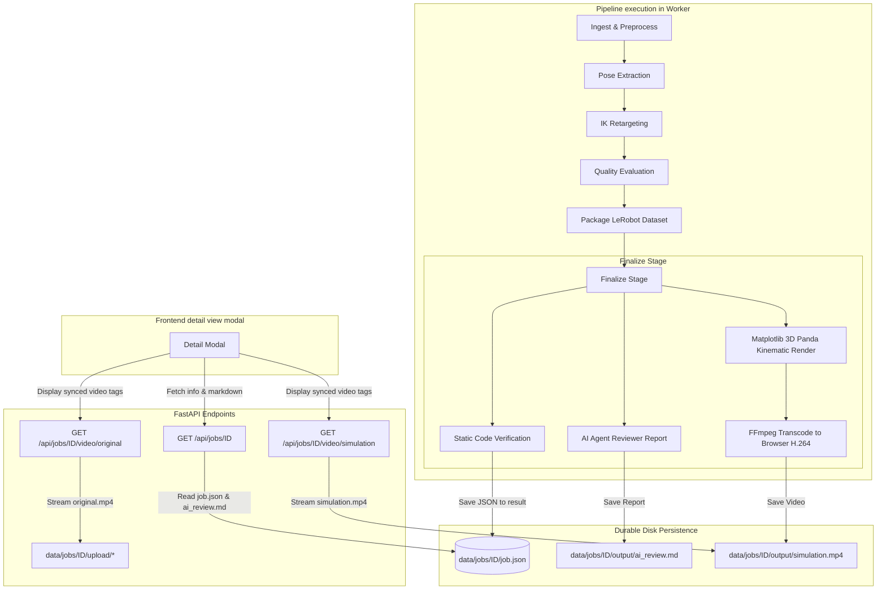

# Plan: Visual Feedback, Video Comparison, and Multi-Staged Review

This document outlines the design and implementation plan to add:
1. **Durable Visual Feedback**: Submission detail view in the frontend.
2. **LeRobot Simulation Rendering**: Headless 3D rendering of the Franka Panda executing the retargeted trajectory.
3. **Multi-staged Review**: Static checks (code/file verification) and an automated AI Agent Reviewer.
4. **Git Branching Strategy**: Feature branches to split the work and merge to `main`.

---

## Architectural Overview

Below is the workflow showing how the pipeline is extended during the `finalize` stage, and how the frontend serves these assets.



---

## Split of Work & Branch Strategy

We will implement this in three sequenced feature branches, ensuring that each branch is fully tested and linted before merging to `main`.

| Feature Branch | Focus Area | Scope / Changes | Status |
|---|---|---|---|
| `feature/render-simulation` | Backend rendering engine | Franka Panda Forward Kinematics, Matplotlib 3D renderer, FFmpeg transcode, `simulation.mp4` output. | Proposed |
| `feature/staged-review` | Verification & AI Review | Parquet and meta schema static verification, dynamic template-based robotics AI Reviewer, markdown generation, job result saving. | Proposed |
| `feature/submission-detail-view` | Frontend & API Integration | Video streaming endpoints, UI detail modal, synced side-by-side video playback, interactive joint trajectory SVG charts, static check and AI report rendering. | Proposed |

---

## Branch 1: `feature/render-simulation`

### Objectives
1. Implement Forward Kinematics (FK) for the 7-DOF Franka Panda.
2. Render the joint trajectory in 3D frame-by-frame using matplotlib.
3. Transcode the output to a browser-compatible H.264 MP4 using FFmpeg.
4. Save the video as `output/simulation.mp4` under the job's directory.

### Detailed Design & Math
We will define homogenous transformations for the Panda arm:
- $\text{Base} \rightarrow \text{Joint } 1 \rightarrow \dots \rightarrow \text{End-Effector}$
- Links and lengths matching standard Franka specifications.
- Headless matplotlib rendering using `fig.canvas.draw()` and OpenCV `VideoWriter`.
- Run transcoding: `ffmpeg -y -i raw.mp4 -vcodec libx264 -pix_fmt yuv420p simulation.mp4` for direct browser compatibility.

### Verification Tasks
- [ ] Add unit tests for forward kinematics to ensure correct coordinates for home posture.
- [ ] Add integration tests verifying `simulation.mp4` is successfully generated on a 10-frame dummy trajectory.
- [ ] Run `make check` (lint & format).

---

## Branch 2: `feature/staged-review`

### Objectives
1. Create a static verification module that validates:
   - File structure (existence of parquet, `meta.json`, `stats.json`).
   - Parquet columns (`observation.state`, `action`, `timestamp`, `episode_index`).
   - Trajectory values (checks for `NaN` and bounds).
2. Create an AI Agent Reviewer:
   - Uses quality metrics (jerk, velocities, limit proximity, sudden jumps) to write a detailed markdown report.
   - Report contents: Overall approval decision, summary of anomalies, workspace coverage, recommendations for improvement.
3. Integrate both checks into the pipeline `FINALIZE` stage. Write outputs to `job.json` and save `ai_review.md` in the job's output.

### Verification Tasks
- [ ] Unit tests for static check module with valid and corrupt dataset structures.
- [ ] Unit tests for AI reviewer report generator showing correct decisions based on metrics.
- [ ] Ensure pipeline runs end-to-end and outputs both `ai_review.md` and verification results.
- [ ] Run `make check`.

---

## Branch 3: `feature/submission-detail-view`

### Objectives
1. Add endpoints `GET /api/jobs/{id}/video/original` and `GET /api/jobs/{id}/video/simulation` in `backend/routes.py` with access controls.
2. Implement a details modal in `frontend/index.html` and `frontend/app.js` styled with CSS variables (glassmorphism/dark mode).
3. Synchronize play/pause/scrub controls for both video players.
4. Draw an interactive joint trajectory line chart using inline SVG (fully customizable, lightweight, zero dependencies).
5. Display static checks checklist and render AI Reviewer markdown text (using a basic markdown-to-HTML parser).

### UI Mockup Idea
```
+-------------------------------------------------------------+
| Job Details: video_sample.mp4                       [Close] |
+------------------------------+------------------------------+
| [Original Video]             | [Simulation Video]           |
| (Plays in sync with right)   | (Plays in sync with left)    |
| [Play/Pause] [======Scrubber=======]                        |
+------------------------------+------------------------------+
| Joint Trajectory Chart       | Review & Checks              |
|   (Joint 0-6 line plots)     | Static Code Checks:          |
|                              |  [x] Parquet Format (Pass)   |
|                              |  [x] Schema Verification     |
|                              |                              |
|                              | AI Agent Review:             |
|                              |  Grade: GREEN (Approved)     |
|                              |  Smoothness is excellent.    |
|                              |  Recommendations: ...        |
+------------------------------+------------------------------+
```

### Verification Tasks
- [ ] E2E integration test verifying endpoints return 200 for owned jobs and 404/403 for unauthorized users.
- [ ] Manual verification of detail modal popup, synced video play, and SVG line chart.
- [ ] Verify full test suite passes with `make check`.

---

## Definition of Done (DoD)
- Each feature branch runs all unit tests successfully.
- No regression in isolation or auth.
- Code conforms to nesting $\le 3$ and function length $\le 50$ guidelines.
- Clean merge of branches into `main` sequentially.
